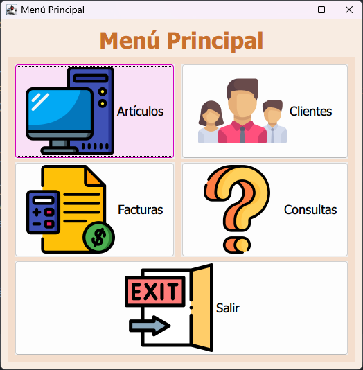

# Project Overview

This project is a comprehensive management system in Spanish for a hardware store, designed to streamline operations and improve customer experience. The system includes features for managing articles, clients, invoices, and more.
IntelliJ IDEA was picked due to modularity with GUI design and class relationship.

## Features

*   Article Management: Create, update, and delete articles, including their specifications and prices.
*   Client Management: Manage client information, including their purchase history and loyalty programs.
*   Invoice Management: Generate and manage invoices for clients, including calculations for subtotal, total, and discounts.
*   User Interface: A user-friendly interface for navigating the system's features, including menus, buttons, and forms.
*   Storage: It stores data in a file.

## System Requirements

*   Java Runtime Environment (JRE) 17 or later
*   Java Development Kit (JDK) 17 or later (for development)
*   IntelliJ IDEA (for development)

## Project Structure

The project is organized into the following packages:

*   `src`: Source code for the project, including Java classes and forms.
*   `img`: Image files used in the project, including icons and logos.

## Key Classes and Methods

*   `Articulo.java`: Represents an article, including its specifications and price.
*   `Cliente.java`: Represents a client, including their purchase history and loyalty programs.
*   `Factura.java`: Represents an invoice, including calculations for subtotal, total, and discounts.
*   `GestionArticulos.java`: Manages articles, including creation, update, and deletion.
*   `GestionClientes.java`: Manages clients, including creation, update, and deletion.
*   `GestionFactura.java`: Manages invoices, including creation, update, and deletion.

## Usage

1.  Compile the project using IntelliJ IDEA.
2.  Run the project using the `Main.java` class.
3.  Navigate the system's features using the menus, buttons, and forms.

## License

No license.

## Acknowledgments

*   The JetBrains team for providing a comprehensive development environment.
*   The Java community for creating a robust and versatile programming language.
